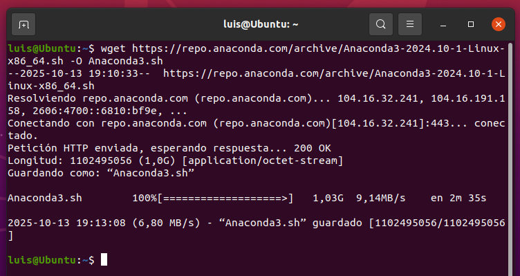
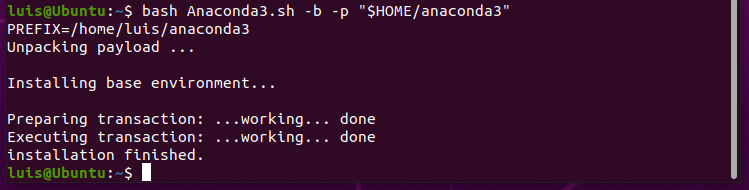
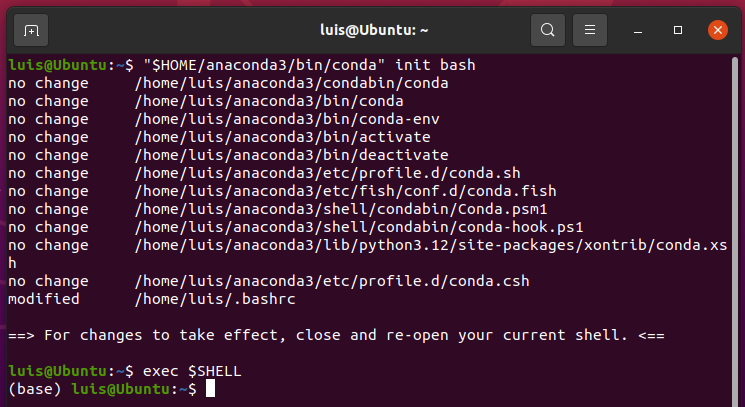
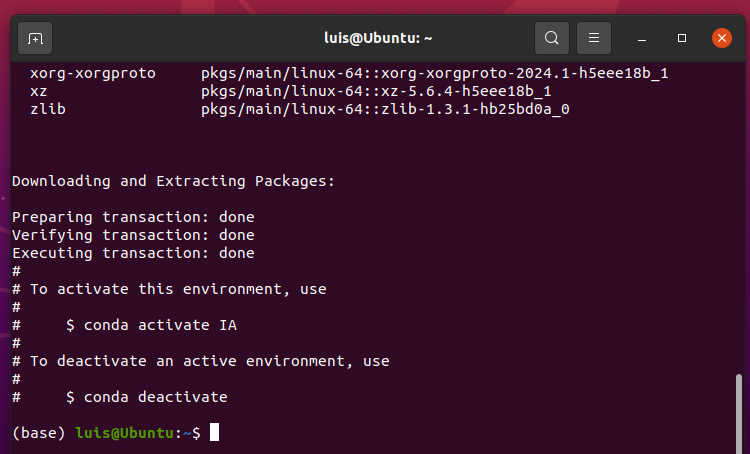
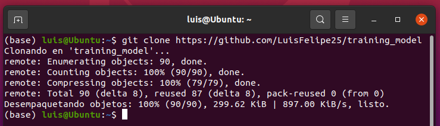
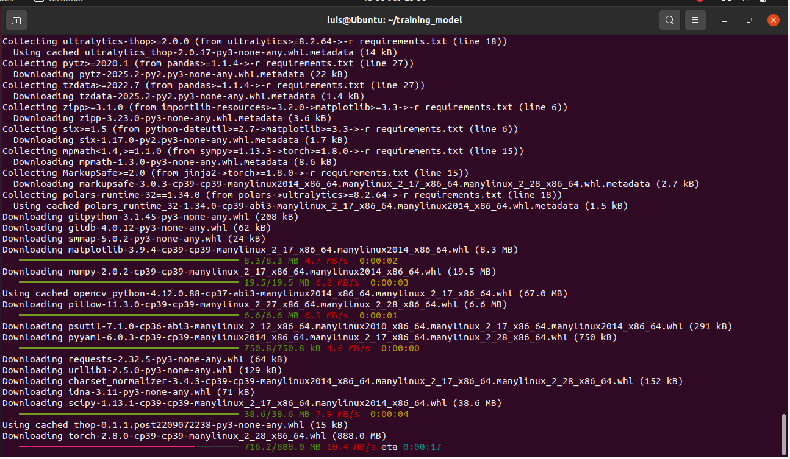
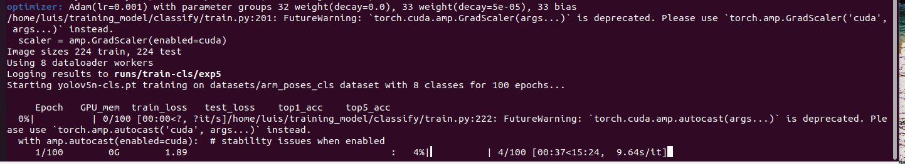
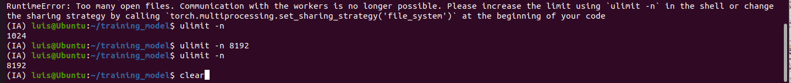

<div align="center">
  <p>
    <a href="#" target="_blank">
      
    </a>
  </p>

  <div>
    <a href="#"></a>
    <a href="#"></a>
    <a href="#"></a>
    <a href="#"></a>
    <a href="#"></a>
  </div>
  <br>

  <strong>IntelliGest</strong> — Entrenamiento de clasificadores de gestos (poses de brazos) con <b>YOLOv5-cls</b> en Ubuntu 22.04.<br/>
  Guía completa desde el entorno hasta la exportación a <b>ONNX</b>, con ejemplos de dataset y comandos listos para copiar/pegar.
</div>

<br>

## 🧭 Tabla de contenidos
- [Descripción](#-descripción)
- [Requerimientos](#-requerimientos)
- [Configuración del entorno](#-configuración-del-entorno)
- [Estructura del dataset](#-estructura-del-dataset)
- [Generar dataset desde video (`extract_frames.py`)](#-generar-dataset-desde-video-extract_framespy)
- [Entrenamiento con YOLOv5-cls](#-entrenamiento-con-yolov5-cls)
- [Exportar a ONNX](#-exportar-a-onnx)
- [Notas y solución de problemas](#-notas-y-solución-de-problemas)
- [Créditos](#-créditos)

---

## 📌 Descripción
**IntelliGest** es un proyecto de visión por computador para **clasificar poses de brazos** (ej. *both_arms_up, arms_side, arms_down, etc.*) usando **YOLOv5-cls**.  
Incluye:
- Instalación del entorno (Anaconda, Python 3.9)
- Organización de datasets `train/val/test`
- Script para **extraer fotogramas de video** y generar datasets masivos
- **Entrenamiento** del clasificador
- **Exportación a ONNX** para despliegues multiplataforma

---

## ✅ Requerimientos
- **Sistema:** Ubuntu **22.04**
- **Python:** **3.9** (recomendado usar conda)

---

## 🛠️ Configuración del entorno

<details open>
<summary><b>1) Instalar Anaconda3</b></summary>

Descarga el instalador más reciente para Linux y ejecútalo:

```bash
wget https://repo.anaconda.com/archive/Anaconda3-2024.10-1-Linux-x86_64.sh -O Anaconda3.sh
bash Anaconda3.sh -b -p "$HOME/anaconda3"
```

Progreso de descarga e instalación:




</details>

<details open>
<summary><b>2) Inicializar conda y crear entorno</b></summary>

```bash
$HOME/anaconda3/bin/conda init bash
exec $SHELL

# Crear entorno con Python 3.9
conda create -n IA python=3.9 -y

# Activar / Desactivar
conda activate IA
conda deactivate
```

  
  

</details>

<details open>
<summary><b>3) Clonar el proyecto e instalar dependencias</b></summary>

```bash
git clone https://github.com/LuisFelipe25/training_model
cd training_model/
pip install -r requirements.txt
```

  

</details>

---

## 🗂️ Estructura del dataset

Organiza tu dataset así (puedes cambiar `arm_poses_cls`, pero **no** `datasets/`):

```
training_model
└── datasets
    └── arm_poses_cls
        ├── train
        │   ├── both_arms_up
        │   ├── arms_side
        │   ├── arms_down
        │   ├── right_arm_side
        │   ├── left_arm_side
        │   ├── right_arm_up
        │   ├── left_arm_up
        │   └── arms_crossed
        ├── val
        │   ├── both_arms_up
        │   ├── arms_side
        │   ├── arms_down
        │   ├── right_arm_side
        │   ├── left_arm_side
        │   ├── right_arm_up
        │   ├── left_arm_up
        │   └── arms_crossed
        └── test
            ├── both_arms_up
            ├── arms_side
            ├── arms_down
            ├── right_arm_side
            ├── left_arm_side
            ├── right_arm_up
            ├── left_arm_up
            └── arms_crossed
```

**Sugerencia:** crea un `labels.txt` (una clase por línea):
```
arms_up
arms_side
arms_down
right_arm_side
left_arm_side
right_arm_up
left_arm_up
arms_crossed
```

---

## 🎞️ Generar dataset desde video (`extract_frames.py`)

Si necesitas más imágenes por clase, usa el extractor de fotogramas.

**Dependencias:**
```bash
pip install opencv-python numpy
```

**Sintaxis general:**
```bash
python extract_frames.py <ruta/al/video.mp4> \
  --width 224 --height 224 \
  --target 5000 \
  --format jpg --quality 95 \
  -o dataset_frames \
  <prefijo_salida>
```

> Ejemplo: genera **5000** imágenes 224×224 en `dataset_frames/` con prefijo `arms_up`.

---

## 🏋️ Entrenamiento con YOLOv5-cls

Ejecuta el entrenamiento (ajusta `<nombre_de_dataset>` a tu carpeta dentro de `datasets/`):

```bash
python classify/train.py --model yolov5n-cls.pt --data datasets/<nombre_de_dataset> --epochs 100 --batch-size 8 --imgsz 224
```

Si ves una UI/registro similar, el entrenamiento comenzó correctamente:



### 🔧 Ejecutar en CPU si no hay GPU NVIDIA
Si aparece un error de CUDA (sin GPU NVIDIA o drivers), fuerza CPU:

```bash
python classify/train.py --model yolov5n-cls.pt --data datasets/<nombre_de_dataset> --epochs 100 --batch-size 8 --imgsz 224 --device cpu
```

Los resultados y métricas se guardan en `runs/train-cls/exp/`.

---

## 📦 Exportar a ONNX

**¿Qué es ONNX?**  
Formato abierto para intercambiar modelos entre frameworks, runtimes y compiladores.

**Instalar dependencias de exportación:**
```bash
sudo apt-get update
sudo apt-get install -y dotnet-sdk-7.0

python -m pip install --upgrade pip
pip install nncase==2.9.0
pip install nncase-kpu==2.9.0
pip install onnx onnxruntime onnxsim
```

**Exportar el mejor checkpoint a ONNX** (ajusta la ruta de `--weight` si tu `exp` cambió):
```bash
python export_onnx.py --weight runs/train-cls/exp/weights/best.pt --imgsz 224 --batch 1 --include onnx
```

Esto generará `best.onnx` junto al `.pt`.

---

## 🧯 Notas y solución de problemas

- **DataLoader con datasets muy grandes**  
  Aumenta el límite de *file descriptors* si hay errores:
  ```bash
  ulimit -n          # Ver límite actual
  ulimit -n 8192     # Ejemplo de aumento
  ```
  

- **Estructura de carpetas**  
  Respeta estrictamente los niveles `train/`, `val/`, `test/` y las clases como subcarpetas.

- **Versión de Python**  
  Usa **Python 3.9** dentro del entorno `IA` para evitar incompatibilidades.

---

## 🙌 Créditos
Autor: **Luis Felipe Fuentes Tapias** — <luisfelipe.ft@ieee.org> — [GitHub: @LuisFelipe25](https://github.com/LuisFelipe25)

<div align="center">
  
</div>
